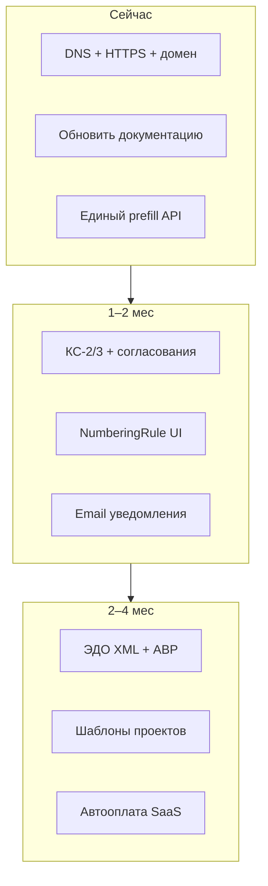

# Аудит проекта Manexa

> **Дата:** 12 июня 2026  
> **Версия:** 1.0.0 (`package.json`)  
> **Окружение:** офисный сервер `manexa-linux` (192.168.100.2), LAN без публичного HTTPS  
> **Метод:** анализ кода, документации, сборка (`npm run build`), smoke-тесты (`npm test`), lint, фактическое состояние деплоя

---

## 1. Резюме

**Manexa** — зрелый B2B SaaS для строительных и проектных компаний на **Next.js 14 + custom `server.js`**. Ядро (проекты, сметы, документы DOCX/XLSX, УПД, финансы, согласования) **работоспособно** и задеплоено в офисной сети.

| Категория | Оценка | Комментарий |
|-----------|--------|-------------|
| Функциональность документов | 🟢 Высокая | Договор, КП, счёт, УПД, шаблоны, версии, async-экспорт |
| Платформенная админка | 🟡 Средняя | `/platform` реализована, billing — ручной режим |
| Production-ready | 🟡 Средняя | LAN-деплой OK; интернет, HTTPS, DNS — нет |
| Безопасность | 🟡 Средняя | RBAC есть; публичные endpoints, демо-пароли в docs |
| Тесты | 🔴 Низкая | Smoke + скрипты на документы; нет Jest/E2E |
| Документация | 🟡 Средняя | Много файлов, часть устарела |

**Главные риски сейчас:** нет выхода в интернет с сервера (DNS/шлюз), нет HTTPS, устаревшие сводные документы (`НЕРЕАЛИЗОВАННЫЙ_ФУНКЦИОНАЛ.md`, секция SaaS в `ROADMAP`), дублирование API генерации документов.

---

## 2. Технический стек

| Слой | Технологии |
|------|------------|
| Frontend | Next.js 14 App Router, React 18, TypeScript, Tailwind, Radix UI |
| Backend | API Routes, NextAuth 4 (JWT), RBAC |
| БД | PostgreSQL 15, Prisma 5 (~39 моделей) |
| Файлы | MinIO (S3) |
| Очереди | BullMQ + Redis |
| PDF | Gotenberg (УПД), pdf-lib, puppeteer |
| Документы | docxtemplater, exceljs, XLSX-патчер УПД |
| Realtime | Socket.IO + Redis adapter |
| Деплой | PM2, rsync, `scripts/deploy.sh` |
| Платформа | Роли PLATFORM_ADMIN/MANAGER, 2FA (TOTP), подписки, аудит |

**Не подходит:** Vercel / чистый `next start` без `server.js` (WebSocket, cron, воркеры).

---

## 3. Что работает (подтверждено)

### 3.1. Бизнес-модули

| Модуль | Статус |
|--------|--------|
| Проекты, участники, RBAC | ✅ |
| Сметы (+ статические шаблоны смет) | ✅ |
| График работ, чек-листы, фото этапов | ✅ |
| Задачи, подзадачи, комментарии | ✅ |
| Договор / КП / счёт (редактор + DOCX) | ✅ |
| УПД (XLSX + PDF через Gotenberg) | ✅ + golden-тесты |
| Шаблоны DOCX, справочник тегов | ✅ `/templates/guide` |
| Нумерация документов (логика) | ✅ без UI настроек |
| Асинхронный экспорт | ✅ BullMQ + `manexa-export-worker` |
| Версии документов | ✅ |
| Финансы, бюджет, KPI | ✅ частично |
| Согласования | ✅ слабая связь с блокировкой редактирования |
| In-app уведомления | ✅ |
| Поиск контрагента (ИНН / DaData) | ✅ |
| Чат (текст, @, #проекты) | ✅ без вложений |
| Отчёты Excel | ✅ |

### 3.2. Платформа (июнь 2026)

| Функция | Статус |
|---------|--------|
| Роли PLATFORM_ADMIN / PLATFORM_MANAGER | ✅ |
| Панель `/platform` (компании, billing, аудит, пользователи) | ✅ |
| Создание компании + директор + триал | ✅ |
| Подписки, тарифы, ручные оплаты | ✅ |
| Cron статусов подписок (PAST_DUE → SUSPENDED) | ✅ |
| Лимиты тарифа (пользователи, проекты) | ✅ |
| `mustChangePassword` | ✅ |
| 2FA для платформенных ролей | ✅ |
| Impersonation (вход от имени пользователя) | ✅ |
| Публичная регистрация отключена (prod) | ✅ |
| Страница `/suspended` | ✅ |

### 3.3. Инфраструктура

| Компонент | Статус |
|-----------|--------|
| `scripts/deploy.sh` (rsync, db push, build, PM2) | ✅ |
| Fallback: local npm + rsync `node_modules` / `.next` | ✅ |
| `scripts/fix-server-dns.sh` | ✅ создан, **не применён** (нужен sudo) |
| CI: lint + smoke + build | ✅ GitHub Actions |
| CI deploy на сервер | ❌ закомментирован |
| HTTPS / Caddy | 📋 только пример `deploy/Caddyfile.example` |

---

## 4. Ошибки и баги

### 4.1. Критические (открытые)

| # | Проблема | Влияние | Рекомендация |
|---|----------|---------|--------------|
| C1 | **Нет DNS и шлюза** на `enp1s0` сервера | `npm install` / build на сервере падают без обходных путей | `sudo bash scripts/fix-server-dns.sh`; проверить NAT на роутере 192.168.100.1 |
| C2 | **Нет HTTPS** | Нельзя безопасно вывести в интернет; NextAuth cookies | VPS + Caddy или проброс 443 + Let's Encrypt |
| C3 | **Два API генерации документов** (`/api/documents/draft` vs `/api/documents/generate`) | Расхождение полей prefill, дублирование логики | Единый `prefill`-сервис; deprecate `generate` |
| C4 | **`prisma migrate deploy` не используется** | Политика `db push` — риск drift схемы на нескольких окружениях | Baseline миграция + `migrate deploy` для prod |

### 4.2. Исправленные (не регрессировать)

- Google Fonts на сервере → локальные WOFF2
- `serverExternalPackages` → `experimental.serverComponentsExternalPackages`
- Удаление пользователей с FK → 409 + деактивация
- Базовый шаблон КП отдельно от договора
- Теги договора/КП (корр. счёт, ОГРН, банк клиента)
- Кнопка «На согласование» в редакторе документов

### 4.3. Средние

| # | Проблема | Где |
|---|----------|-----|
| M1 | Нет статуса `ON_APPROVAL` / блокировки редактирования после отправки на согласование | `DocumentEditorHeader`, API документов |
| M2 | `counterparty/lookup` без `export const dynamic = 'force-dynamic'` | Warning при static generation в build |
| M3 | Rate limit in-memory при `PM2_INSTANCES > 1` | `src/lib/rate-limit.ts` |
| M4 | Настройки уведомлений частично в `localStorage`, не в БД | `settings/page.tsx` |
| M5 | Email / SMS / Push — UI есть, отправка не подключена | `settings/page.tsx`, nodemailer в env |
| M6 | 2FA только для платформенных ролей, не для компаний | `auth.ts` |
| M7 | `next.config.js` — `images.domains: ['localhost']` | Нужно добавить prod-домен при выходе в интернет |
| M8 | Демо-пароли в `README.md`, `docs/USER_GUIDE.md` | `admin123` и т.п. |

### 4.4. Lint / build (не блокируют, но накапливаются)

- **15+ предупреждений** `react-hooks/exhaustive-deps` (documents, finance, tasks, templates, schedule…)
- **2 предупреждения** `@next/next/no-img-element` в `schedule/page.tsx` (фото этапов)
- Сборка: **успешна** (`npm run build` ✅)
- Smoke: **успешен** (`npm test` ✅)

### 4.5. TODO в коде

Только **2** настоящих TODO (остальные `TODO` — статус задачи в UI):

```text
src/lib/alerts.ts:196 — TODO: Implement database monitoring
src/lib/alerts.ts:201 — TODO: Implement security monitoring
```

---

## 5. Безопасность

### 5.1. Сильные стороны

- `src/lib/env.ts` + `scripts/validate-env.cjs` — валидация секретов в production
- `prod-guard.ts` — отключение регистрации и debug-роутов
- RBAC на уровне API (`checkPermission`, `checkPlatformPermission`)
- Rate limit на login, смену пароля, lookup ИНН
- Изоляция платформенных ролей от API компаний
- Блокировка компаний с `SUSPENDED` / архивом
- Аудит действий платформы (`PlatformAuditLog`)
- Сессия платформы — 4 часа

### 5.2. Риски

| Риск | Уровень | Детали |
|------|---------|--------|
| Публичные API без auth | 🟡 | `/api/counterparty/lookup` (только rate limit по IP) |
| | 🟡 | `/api/templates/base/*` — скачивание базовых DOCX без входа |
| Debug endpoints | 🟡 | `/api/test-auth`, `/api/notifications/test` при `ALLOW_DEBUG_ROUTES=true` |
| Health metrics | 🟢 | `/api/health` при `HEALTH_PUBLIC=true` |
| Middleware не защищает API | 🟡 | `matcher` исключает `/api/*` — каждый route сам проверяет auth |
| Hardcoded secrets в коде | 🟢 | Не обнаружены |
| Impersonation | 🟡 | Только PLATFORM_ADMIN, одноразовый токен, аудит — OK, но критичный путь |
| MinIO/Postgres/Redis наружу | 🟢 | На LAN не открыты (проверить firewall при выходе в интернет) |

### 5.3. Чеклист перед публичным запуском

- [ ] HTTPS (Caddy + Let's Encrypt)
- [ ] `NEXTAUTH_URL` / `NEXT_PUBLIC_APP_URL` = `https://домен.ru`
- [ ] `ALLOW_PUBLIC_REGISTRATION=false`
- [ ] Сменить все дефолтные пароли (Postgres, MinIO, seed)
- [ ] Убрать демо-учётки из README
- [ ] `ALLOW_DEBUG_ROUTES=false`, `HEALTH_PUBLIC=false`
- [ ] Закрыть `/api/counterparty/lookup` за auth или жёсткий rate limit + captcha
- [ ] Ежедневные бэкапы БД и MinIO
- [ ] Firewall: только 22, 443

---

## 6. Нереализованный функционал

### 6.1. Полностью отсутствует

| Функция | Примечание |
|---------|------------|
| **КС-2, КС-3** | Рендереры в коде, UI/API отключены до шаблонов ФНС |
| **АВР** | Не начат |
| **ЭДО XML** | Заглушка `xml-renderer-stub.ts`; поля `edoStatus` / `edoXmlPath` пустые |
| **HTML-шаблоны** | `template-engine.ts`, `system-templates.ts` — legacy |
| **E2E-тесты** | Playwright не подключён |
| **OpenAPI / внутренняя документация API** | Старый `/api/docs` удалён |

### 6.2. Частично реализовано

| Функция | Что есть | Чего нет |
|---------|----------|----------|
| **NumberingRule** | Логика в БД + `document-numbering.ts` | UI в `/settings`, API `/api/numbering-rules` |
| **Финансы / счета** | `Document` + `INVOICE`, страница finance | Модель `Invoice` в БД не используется; автосвязь оплата → Finance |
| **Согласования ↔ документы** | Кнопка, бейдж, фильтр по `documentId` | Блокировка редактирования, статус `ON_APPROVAL` |
| **УПД** | Встроенная XLSX-форма ФНС | Кастомный шаблон компании |
| **Уведомления** | In-app, cron дедлайнов | Email/SMS/Push |
| **Чат** | Текст, Socket.IO | Вложения, emoji |
| **Шаблоны смет** | Hardcoded `ESTIMATE_TEMPLATES` | Шаблоны в БД, редактор |
| **SaaS billing** | Тарифы, ручные оплаты, лимиты | Автооплата, счета клиентам, self-service смена тарифа |
| **Мониторинг** | PM2, `/api/health` | Алерты БД/security (`alerts.ts` — TODO) |

### 6.3. Устаревшая документация (не соответствует коду)

| Файл | Проблема |
|------|----------|
| `НЕРЕАЛИЗОВАННЫЙ_ФУНКЦИОНАЛ.md` | SaaS billing, PLATFORM_MANAGER, mustChangePassword — **уже реализованы** |
| `docs/ROADMAP_AND_ISSUES.md` §4.8 | То же — статусы SaaS не обновлены |
| `docs/TEMPLATES_IMPLEMENTATION_ROADMAP.md` | Описывает состояние 2025 («нет DOCX») |
| `docs/USER_GUIDE.md` | «Project Portal», демо-пароли |
| `README.md` | Демо-аккаунты, нет Redis/Gotenberg/PM2/platform |
| `ИДЕИ_УЛУЧШЕНИЙ.md` | Чек-листы и фото помечены как TODO, но **уже сделаны** |

**Актуальные точки входа:** `docs/PRODUCTION.md`, `docs/DEPLOYMENT.md`, `docs/ADMIN_PANEL_PLAN.md`, `docs/ROADMAP_AND_ISSUES.md`, `/templates/guide`.

---

## 7. Тестирование

| Тип | Покрытие |
|-----|----------|
| Unit-тесты в `src/` | ❌ Нет Jest/Vitest |
| E2E (Playwright) | ❌ |
| Smoke (`npm test`) | ✅ Структура, legacy routes, CI |
| Доменные скрипты | ✅ УПД, нумерация, counterparty, invoice template, docx tags |
| CI | lint + smoke + build; **доменные тесты не в CI** |

**Рекомендация:** добавить в CI `npm run test:upd` и `npm run test:numbering`; позже — Playwright smoke на staging.

---

## 8. Инфраструктура и деплой

### Текущее состояние сервера

| Параметр | Значение |
|----------|----------|
| IP | 192.168.100.2 (LAN) |
| Доступ из интернета | ❌ |
| DNS | ❌ не настроен (`resolvectl` — пустые scopes) |
| Шлюз | ❌ не задан на `enp1s0` |
| Сборка на сервере | ⚠️ падает без интернета → fallback local `.next` |
| PM2 | `manexa` + `manexa-export-worker` online |

### Выход в интернет по домену

**Возможно**, но нужно:

1. VPS **или** белый IP + проброс 443 на роутере
2. DNS A-запись домена → IP сервера
3. Caddy (`deploy/Caddyfile.example`)
4. Обновить `.env`: `NEXTAUTH_URL`, `NEXT_PUBLIC_APP_URL`
5. Применить `fix-server-dns.sh` (офисный вариант)

---

## 9. Идеи развития

### P0 — стабильность (1–2 недели)

1. Починить DNS/шлюз на сервере или перейти на VPS
2. HTTPS + домен
3. Объединить `draft` и `generate` API документов
4. Обновить `НЕРЕАЛИЗОВАННЫЙ_ФУНКЦИОНАЛ.md`, `README`, `ROADMAP` §4.8
5. Валидация шаблона при загрузке (обязательные теги по категории)
6. Добавить `test:upd` в CI

### P1 — документооборот (1–2 месяца)

1. **КС-2 / КС-3** — шаблоны ФНС + golden-тесты + UI
2. **Блокировка редактирования** при согласовании
3. **UI NumberingRule** в настройках компании
4. **УПД** — опциональный кастомный XLSX-шаблон
5. **АВР** — новый тип документа
6. **ЭДО XML** — сериализация УПД по XSD (без оператора)
7. Email-уведомления (дедлайны, приглашения)

### P2 — операционка на объекте

1. **Шаблоны проектов** (копирование этапов, смет, задач) — из `ИДЕИ_УЛУЧШЕНИЙ.md`
2. Шаблоны смет в БД (не hardcoded)
3. Фото-отчёт / график работ → PDF для клиента
4. Вложения в чате
5. Мобильный UI для быстрых расходов на объекте
6. Дашборд «прогресс объекта» для заказчика (read-only ссылка)

### P3 — коммерческий SaaS

1. Автоматическая оплата (ЮKassa / CloudPayments) + webhook продления
2. Self-service: смена тарифа, счета, акты для клиентов платформы
3. Email-приглашения сотрудников (доработать `/api/auth/invite`)
4. 2FA для ролей компании (OWNER, ADMIN)
5. Лимит хранилища MinIO по тарифу (сейчас только users/projects)
6. Публичная landing-страница + форма «Запросить демо»
7. Резервное копирование с off-site хранением
8. Sentry / централизованные логи

### P4 — качество и DX

1. Playwright E2E: вход → проект → КП → экспорт
2. Unit-тесты на `document-numbering`, `template-mapper`, RBAC
3. OpenAPI-спека или внутренняя `/dev/api` (только dev)
4. Prisma migrate baseline + убрать `db push` на prod
5. Архивировать устаревшие docs (`AUDIT_REPORT_2024`, `DAILY_REPORT_2024`)
6. Storybook для UI-компонентов (опционально)

### P5 — идеи из продуктовой линейки

| Идея | Польза |
|------|--------|
| Интеграция с 1С (выгрузка УПД / счетов) | Снижение двойного ввода |
| Telegram-бот уведомлений | Прорабы на объекте |
| OCR счетов-фактур поставщиков | Автозаполнение финансов |
| Сравнение версий DOCX (diff) | Юристы и согласования |
| Мульти-язык UI | Редко для РФ, но для экспансии |
| API-ключи для интеграций | CRM, внешние сметные системы |
| White-label (логотип компании на портале) | Агентская модель продаж |
| AI-помощник по смете (подсказка позиций) | Ускорение заполнения |
| Календарь ресурсов (бригады) | Планирование загрузки |
| Электронная подпись (КЭП) | Юридически значимый обмен |

---

## 10. Матрица «обещание → реальность»

| Обещание (README / презентация) | Реальность (июнь 2026) |
|--------------------------------|------------------------|
| КС-2, КС-3, акты | КС-2/3 отложены; акт = УПД |
| Версионирование документов | ✅ |
| Настраиваемая нумерация | ✅ в коде, ❌ UI |
| Шаблоны договоров, КП, счетов | ✅ DOCX |
| Полный набор закрывающих | Частично (нет КС, АВР, ЭДО) |
| SaaS multi-tenant | ✅ платформа; billing ручной |
| Real-time чат | ✅ |
| Отчёты Excel | ✅ |
| Публичный SaaS в интернете | ❌ LAN only |
| Админ-панель платформы | ✅ `/platform` |
| 2FA | ✅ платформа; ❌ компании |

---

## 11. Рекомендуемый порядок работ



---

## 12. Связанные файлы

```
docs/PRODUCTION.md              — production-стек
docs/DEPLOYMENT.md              — быстрый старт
docs/ROADMAP_AND_ISSUES.md      — дорожная карта (частично устарела §4.8)
docs/ADMIN_PANEL_PLAN.md        — концепция платформы
docs/PROJECT_AUDIT_2026.md      — этот документ
НЕРЕАЛИЗОВАННЫЙ_ФУНКЦИОНАЛ.md   — требует обновления
ИДЕИ_УЛУЧШЕНИЙ.md               — идеи продукта
ПРОДАКШЕН_ИДЕИ.md                — идеи инфраструктуры
scripts/deploy.sh               — деплой
scripts/fix-server-dns.sh       — починка DNS
```

---

*При закрытии пункта из раздела 4 — обновляйте статус здесь и в `docs/ROADMAP_AND_ISSUES.md`.*
