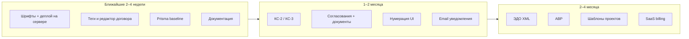

# Manexa — дорожная карта, ошибки и идеи

> Сводный документ по состоянию проекта на **июнь 2026**.  
> Основан на анализе кода, `README`, `docs/*`, `НЕРЕАЛИЗОВАННЫЙ_ФУНКЦИОНАЛ.md`, `ИДЕИ_УЛУЧШЕНИЙ.md`, `ПРОДАКШЕН_ИДЕИ.md` и фактического поведения в production (`manexa-linux`).

---

## 1. Задумка проекта

**Manexa** — SaaS для строительных и проектных компаний: один контур «проект → смета → коммерческое предложение → договор → счёт → УПД → финансы → согласования».

Целевой сценарий:

1. Создать проект с реквизитами клиента (в т.ч. через DaData).
2. Заполнить смету, график работ, задачи.
3. Сгенерировать **КП, договор, счёт** по **своим Word-шаблонам** с тегами.
4. Выставить **УПД** на основании счёта.
5. Учесть оплаты в финансах, согласовать документы, получить отчёты.

Технически: **Next.js 14 + custom `server.js`**, PostgreSQL, MinIO, Redis, Gotenberg, PM2, Socket.IO — **не serverless**.

---

## 2. Что уже работает (опорные модули)

| Модуль | Статус | Примечание |
|--------|--------|------------|
| Проекты, участники, RBAC | ✅ | Фильтрация по ролям в API |
| Сметы, шаблоны смет (статические) | ✅ | `src/lib/estimate-templates.ts` |
| График работ + чек-листы + фото этапов | ✅ | `/projects/[id]/schedule` |
| Задачи, подзадачи, комментарии | ✅ | |
| Договор, КП, счёт (редактор + DOCX) | ✅ | docxtemplater + шаблоны компании |
| УПД (XLSX + PDF через Gotenberg) | ✅ | golden-тесты `npm run test:upd` |
| Шаблоны DOCX + справочник тегов | ✅ | `/templates/guide`, категории CONTRACT / КП / INVOICE |
| Базовый шаблон по умолчанию (`isDefault`) | ✅ | Автоподбор при создании документа |
| Нумерация документов | ✅ | `document-numbering.ts`, без UI настроек |
| Асинхронный экспорт (BullMQ) | ✅ | `manexa-export-worker` |
| Версии документов | ✅ | `DocumentVersion` |
| Финансы, бюджет, KPI | ✅ частично | Счета — через `Document`, не отдельная модель |
| Согласования | ✅ | Отдельный модуль, слабая связь с документами |
| Чат проекта | ✅ частично | Без вложений и emoji |
| In-app уведомления | ✅ | Email/SMS/Push — заглушки |
| Отчёты Excel | ✅ | `POST /api/reports/generate` |
| Поиск контрагента (ИНН) | ✅ | DaData |
| Офисный деплой | ✅ | rsync + локальный `.next` на Linux |

---

## 3. Критические ошибки и риски (исправить в первую очередь)

### 3.1. ✅ Сборка на сервере без интернета к Google Fonts — ИСПРАВЛЕНО

- **Было:** `src/app/layout.tsx` — `import { Inter } from 'next/font/google'`, build на `manexa-linux` падал.
- **Сделано (июнь 2026):** Inter переведён на `next/font/local` (`src/app/fonts/inter-latin.woff2` + `inter-cyrillic.woff2`), сборка не требует доступа к Google Fonts.

### 3.2. ✅ Prisma Migrate не применяется на production — ЗАФИКСИРОВАНА ПОЛИТИКА

- **Симптом:** `prisma migrate deploy` → `P3005` (БД создавалась через `db push`).
- **Сделано:** политика проекта — `prisma db push`, зашита в `scripts/deploy.sh`. Baseline миграций — опционально позже.

### 3.3. ✅ `next.config.js` — нераспознанный ключ — ИСПРАВЛЕНО

- **Было:** предупреждение `Unrecognized key: serverExternalPackages` (Next 14.2).
- **Сделано:** перенесено в `experimental.serverComponentsExternalPackages`.

### 3.4. ✅ Удаление пользователей с внешними ключами — ИСПРАВЛЕНО

- **Было:** `prisma.user.delete` без обработки FK → 500 (`ApprovalAssignment_userId_fkey`).
- **Сделано:** предпроверка связанных записей; при наличии контента — 409 с предложением деактивации (`isActive=false`, вход заблокирован); безопасные связи (назначения, уведомления) удаляются каскадно, опциональные ссылки обнуляются.

### 3.5. Демо-пароли и публичная регистрация в документации

- **Файлы:** `README.md`, `docs/USER_GUIDE.md` — `admin123`, открытая регистрация.
- **В production:** нужны `ALLOW_PUBLIC_REGISTRATION=false`, смена seed-паролей, убрать демо из публичных гайдов.

### 3.6. Два пути генерации документов

- **Новый поток:** `/documents/new` → `POST /api/documents/draft` → редактор → экспорт.
- **Старый API:** `POST /api/documents/generate` — дублирует логику prefill.
- **Риск:** расхождение полей (например, `executorKpp` добавляли в одном месте — нужна синхронизация).
- **Решение:** единый сервис prefill, deprecate `/api/documents/generate` или тонкая обёртка.

---

## 4. Ошибки и пробелы по модулям

### 4.1. Шаблоны и документы

| Проблема | Детали |
|----------|--------|
| ✅ Устаревшая документация | `docs/TEMPLATE_VARIABLES_GUIDE.md` помечен deprecated, ссылка на `/templates/guide` |
| Устаревший roadmap | `docs/TEMPLATES_IMPLEMENTATION_ROADMAP.md` — «нет DOCX», «API generate» — не соответствует коду |
| ✅ Неполный набор тегов договора/КП | Добавлены `executorCorrespondentAccount`, `clientOgrn`, `clientPhone/Email`, банк клиента (июнь 2026) |
| ✅ Редактор договора урезан | `ContractEditor.tsx` — добавлен сворачиваемый блок «Реквизиты сторон» (КПП, ОГРН, банк, контакты) |
| УПД без кастомного шаблона | Только встроенная XLSX-форма |
| КС-2 / КС-3 | Рендереры есть, UI и `create-draft` **отключены** |
| АВР | Не реализован |
| ЭДО XML | Заглушка `xml-renderer-stub.ts`, поля `edoStatus` / `edoXmlPath` в БД пустые |
| Legacy HTML-шаблоны | `template-engine.ts`, `system-templates.ts`, `seed-contract` — не используются в DOCX-потоке |
| ✅ Базовый шаблон КП | Отдельный `commercial-offer-template.docx` (`npm run prepare:co-template`) |
| Скан неизвестных тегов | Показывает предупреждение, но нет подсказки «добавить в справочник» |

### 4.2. Нумерация

- Логика `NumberingRule` в БД и `document-numbering.ts` работает.
- **Нет UI** в `/settings` для формата номера, префикса, сброса по году.
- API `GET/POST /api/numbering-rules` из старого roadmap **не существует**.

### 4.3. Финансы

- README обещает «счета» — реализованы как документы `INVOICE`, не как отдельная сущность.
- Связь «счёт оплачен» → автозапись в `Finance` — проверить/доработать сквозной сценарий.
- `src/app/api/finance/invoices` — уточнить назначение vs документы.

### 4.4. Согласования ↔ документы

- ✅ Кнопка «На согласование» в шапке редактора документа + бейдж статуса согласования (июнь 2026).
- Нет статуса документа `ON_APPROVAL` / блокировки редактирования после отправки.

### 4.5. Уведомления и настройки

- Email / SMS / Push — UI есть, **не подключены** (`settings/page.tsx`).
- 2FA и таймаут сессии — «в разработке», не применяются на сервере.
- Настройки уведомлений о сроках частично в localStorage, не в БД.

### 4.6. Чат

- Нет вложений файлов и emoji (заявлено в `НЕРЕАЛИЗОВАННЫЙ_ФУНКЦИОНАЛ.md`).
- Два чата: глобальный `/chat` и чат в карточке проекта — возможна путаница UX.

### 4.7. Отчёты

- Генерация Excel работает.
- Старый UI-скачивание `.txt` через `/api/reports/download/...` — legacy, лучше унифицировать с `generate`.

### 4.8. Безопасность и SaaS

| Из `ПРОДАКШЕН_ИДЕИ.md` | Статус |
|-------------------------|--------|
| `PLATFORM_MANAGER`, админка платформы | ❌ |
| Подписки / billing | ❌ |
| `mustChangePassword` при первом входе | ❌ |
| Email-приглашения сотрудников | ❌ частично (`/api/auth/invite`) |
| HTTPS + Caddy | 📋 пример в `deploy/Caddyfile.example`, на LAN — HTTP :3000 |

### 4.9. Инфраструктура и деплой

- ✅ `scripts/deploy.sh` создан: rsync, npm install, prisma db push, build на сервере, pm2 restart, healthcheck.
- CI (`deploy.yml`) — lint/build, **деплой закомментирован**.
- Rate limit (`rate-limit.ts`) — in-memory; при `PM2_INSTANCES > 1` без Redis store лимиты не общие.
- `src/lib/alerts.ts` — TODO: мониторинг БД и security.
- ✅ Мусор удалён: `prisma/schema.prisma.backup*`, `prisma/schema 2.prisma`.

---

## 5. Устаревшая и дублирующаяся документация

Рекомендуется **консолидировать** и пометить архивными:

| Файл | Проблема |
|------|----------|
| `docs/TEMPLATE_VARIABLES_GUIDE.md` | Неверный синтаксис, заменён на `/templates/guide` |
| `docs/TEMPLATES_IMPLEMENTATION_ROADMAP.md` | Описывает несуществующее состояние (2025) |
| `docs/TEMPLATES_SYSTEM_PLAN.md` | Дублирует roadmap |
| `docs/AUDIT_REPORT_2024.md` | Часть пунктов исправлена (tasks `assignments`, api/docs удалён) |
| `docs/DAILY_REPORT_2024.md` | Устарел |
| `docs/USER_GUIDE.md` | «Project Portal», демо-пароли |
| `README.md` | `portal-BIZ`, демо-аккаунты, не упоминает Redis/Gotenberg/PM2 |
| Корневые `ИДЕИ_УЛУЧШЕНИЙ.md`, `ПРОДАКШЕН_ИДЕИ.md` | Актуальны как идеи; часть уже реализована (чек-листы, фото) |

**Актуальные точки входа:**

- Production: `docs/PRODUCTION.md`
- Деплой: `docs/DEPLOYMENT.md` → PRODUCTION
- Нереализованное: `НЕРЕАЛИЗОВАННЫЙ_ФУНКЦИОНАЛ.md` (обновить чек-листы/фото)
- Справочник тегов: `/templates/guide` + `src/lib/template-tags.ts`
- Этот файл: `docs/ROADMAP_AND_ISSUES.md`

---

## 6. Идеи развития (приоритеты)

### P0 — стабильность и доверие к документам

1. Self-host шрифтов → сборка на сервере без rsync `.next`.
2. Скрипт деплоя + baseline Prisma migrate.
3. Полный набор тегов договора/КП (корр. счёт, ОГРН/банк клиента) + расширить `ContractEditor`.
4. Отдельный базовый DOCX для КП.
5. Валидация шаблона при загрузке: обязательные теги по категории.
6. Единый prefill-сервис для draft и generate API.

### P1 — закрытие документооборота

1. **КС-2 / КС-3** — официальные шаблоны ФНС + golden-тесты + UI.
2. **УПД** — опционально свой XLSX-шаблон (как счёт).
3. **АВР** — тип документа + шаблон.
4. **ЭДО XML** — сериализация УПД по XSD (без оператора).
5. Связка **документ → согласование → публикация**.
6. UI **NumberingRule** в настройках компании.

### P2 — операционка на объекте

1. Шаблоны **проектов** (копирование этапов, смет, задач) — из `ИДЕИ_УЛУЧШЕНИЙ.md`.
2. Шаблоны смет в БД (сейчас только hardcoded `ESTIMATE_TEMPLATES`).
3. Уведомления о дедлайнах этапов / бюджете — довести cron + email.
4. Быстрое добавление расходов с мобильного UI.
5. Экспорт графика работ / фото-отчёта в PDF для клиента.

### P3 — коммерческий SaaS

> Детальная концепция админ-панели платформы: [`docs/ADMIN_PANEL_PLAN.md`](ADMIN_PANEL_PLAN.md)

1. `PLATFORM_MANAGER`, создание компаний менеджером платформы.
2. Подписки, лимиты (пользователи, проекты, хранилище).
3. Email-приглашения, `mustChangePassword`.
4. 2FA, audit log действий.
5. Мультитенантная изоляция — периодический security review.

### P4 — качество и DX

1. E2E-тесты (Playwright): регистрация → проект → КП → экспорт.
2. Расширить smoke-тесты (`test:live` на staging).
3. Убрать backup-схемы Prisma, `.DS_Store` из репозитория.
4. Обновить `README` и `USER_GUIDE` под Manexa 2026.
5. OpenAPI / внутренняя страница API (старый `/api/docs` удалён).

---

## 7. Рекомендуемый порядок работ (квартальный план)



**Конкретные задачи на спринт:**

- [x] `Inter` → local font, проверить `npm run build` на Linux
- [x] `scripts/deploy.sh`: rsync, `prisma db push`/`migrate deploy`, `pm2 restart`
- [x] Дополнить `template-tags.ts`: `executorCorrespondentAccount`, `clientOgrn`, `clientPhone`, `clientEmail`, банк клиента
- [x] Расширить `ContractEditor` (сворачиваемый блок «Реквизиты сторон»)
- [x] Пометить `TEMPLATE_VARIABLES_GUIDE.md` как deprecated, ссылка на `/templates/guide`
- [x] Обновить `НЕРЕАЛИЗОВАННЫЙ_ФУНКЦИОНАЛ.md` (чек-листы ✅, фото ✅)
- [x] Обработка FK при удалении пользователя
- [x] Кнопка «На согласование» в `DocumentEditorHeader` + бейдж статуса согласования
- [x] Отдельный базовый DOCX-шаблон КП (`npm run prepare:co-template`)

---

## 8. Матрица «обещание → реальность»

| Обещание (README / презентация) | Реальность |
|----------------------------------|------------|
| КС-2, КС-3, акты | КС-2/3 отложены; акт = УПД |
| Версионирование документов | ✅ |
| Настраиваемая нумерация | ✅ в коде, ❌ в UI |
| Шаблоны договоров и КП | ✅ DOCX |
| Шаблоны счетов | ✅ добавлено (INVOICE) |
| Закрывающие документы полный набор | Частично |
| SaaS multi-tenant | Один инстанс, без billing |
| Real-time чат | ✅ Socket.IO |
| Отчёты | ✅ Excel |

---

## 9. Связанные файлы в репозитории

```
docs/PRODUCTION.md          — инфраструктура
docs/DEPLOYMENT.md          — быстрый старт
НЕРЕАЛИЗОВАННЫЙ_ФУНКЦИОНАЛ.md
ИДЕИ_УЛУЧШЕНИЙ.md
ПРОДАКШЕН_ИДЕИ.md
ПРЕЗЕНТАЦИЯ_ПРОЕКТА.md      — детальный разбор API
src/lib/document-editor/registry.ts
src/lib/template-tags.ts
```

---

*Документ можно дополнять по мере закрытия пунктов. При исправлении критического бага — менять статус в секции 3 и чек-лист в секции 7.*
